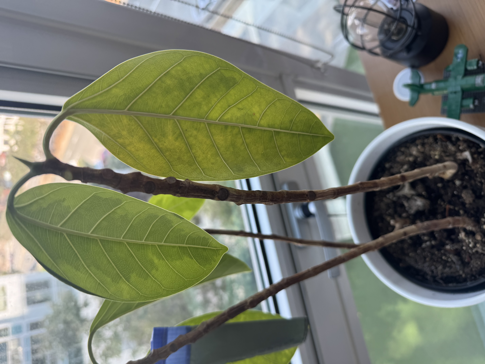
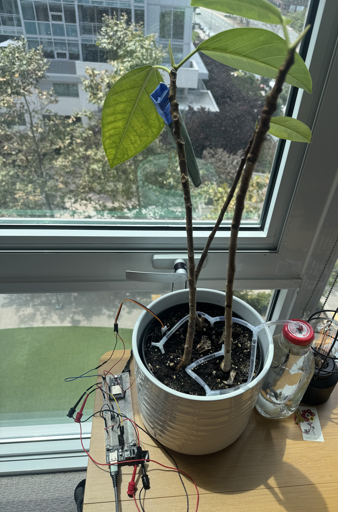
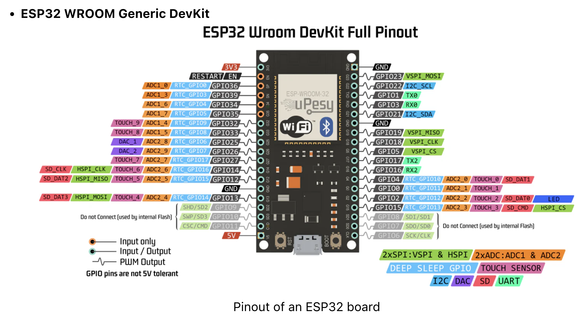
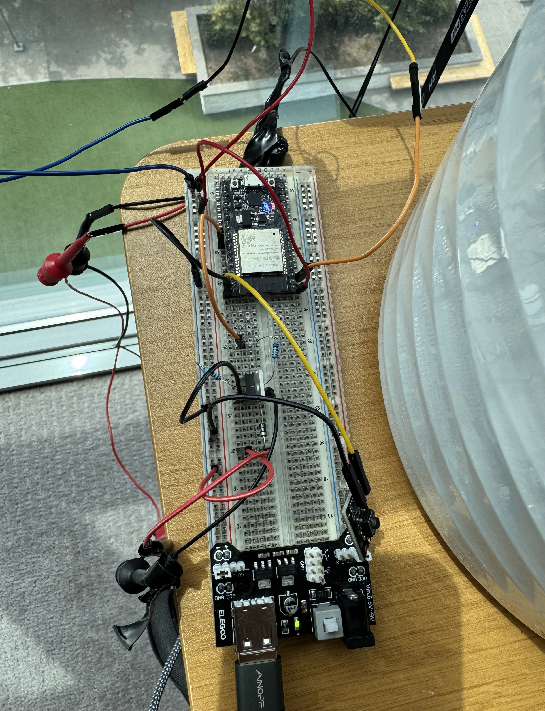

# 🤖 Sprinkletron

An affectionately faithful plant waterer 🤖 💖 🌱 🦾

A single-purpose, low-power plant watering node. It wakes from deep sleep every 72 hours, samples a capacitive soil moisture sensor, and if dryness is detected, it runs a small pump. Then it returns to deep sleep.

What it does **not** do:

- No networking, no clock sync, no manual override, no fancy scheduling
- It only wakes, checks, optionally waters, then sleeps

|  |  |
| :-----------------------: | :-----------------------: |
|      looking sad 😢       |     looking bad 😎 🤩     |

## Install

I used [PlatformIO](https://platformio.org/) to build and upload the code to the ESP32. Get the VSCode extension or just install the CLI tool.

```bash
pio project init --board esp32dev
```

## Build and deploy

```bash
pio run -e esp32dev -t upload
```

## Hardware

[ESP32 microcontroller](https://www.amazon.com/HiLetgo-ESP-WROOM-32-Development-Microcontroller-Integrated/dp/B0718T232Z/ref=sr_1_3_pp?crid=2CQV94O1OGR6H&dib=eyJ2IjoiMSJ9.kzd_BN2te2KAhw5tyJI73iwZ9stA77zzn51rdKmEszU4feVIJwvlwVF7kBoWgQPeMgyoptu8p8PzFvEWpxs40OoVDV9nYCBotN80_zApyaZimXkio5ei2YzGSVvl4dqeCSIJUxzCsaTnyW31OWoWwsTuaZWMGaY5S9vqwavqU0O-cqKcmrz-FhhcZC4ucgOs61cPUe_J0Nli8lbT-HIqCe1nEO4xkyimmhq6HhRRjuQ.lS9xh2RYkxiqmAJ3G8zQThrpcej4UvebpuDbfTgma1s&dib_tag=se&keywords=esp32&qid=1755052045&sprefix=esp%2Caps%2C191&sr=8-3) - A low-power microcontroller with built-in Wi-Fi and Bluetooth capabilities. It is used to control the watering system.

[Breadboard power supply](https://www.amazon.com/Breadboard-Minidodoca-Alligator-Raspberry-Electronic/dp/B0BP9V6WXX/ref=sr_1_1?crid=U1BJFQH6YTKS&dib=eyJ2IjoiMSJ9.oSeKeuwdMzQHSh6XMZ9xst5nq7arbypQQPb5RQhmqlM97TPUxVJbHUCrqBxC0q58dG8GDxHlrEOWtG4X1uttjTsbqlgioDu1OsmwSiv1T-da3vqRt6rwmdx-IYf7ahkuhM0vv54AfiAK3Kq0QQeolcn7nNYEyq1vPacTNDdmzyMU7DxKe6UwdqhZNTGvS-2YYOMkUxrkH19ex5qmsdEDKaeLCkcuxfWEd9lq-dfpzUM.uC9mFgUy00We1Vr0BWzcHfaiN8h9xt-ibtmd8Q9CYbc&dib_tag=se&keywords=elegoo%2Bbread%2Bboard%2Bpower%2Bsupply&qid=1755052097&sprefix=elegoo%2Bbread%2Bboard%2Bpower%2Bsupply%2B%2Caps%2C167&sr=8-1&th=1) - A power supply module that can be plugged into a breadboard to provide power to the ESP32 and other components. It provides 3.3V and 5V outputs.

[Capacitive Soil Moisture Sensor](https://www.amazon.com/dp/B07SYBSHGX?ref=ppx_yo2ov_dt_b_fed_asin_title) - Corrosion Resistant Moisture Detection Garden Watering for Arduino DIY 3.3~5.5V

[Adafruit 4546 Submersible 3V DC](https://www.amazon.com/dp/B085KYZCDV?ref=ppx_yo2ov_dt_b_fed_asin_title) - A small 3V DC pump that can be used to water plants. a DC motor that is powered with 3V and draws 100mA. When powered, the pump sucks water in from the side of the plastic casing and pushes it out the tubing port. The pump must be primed by keeping it inside water at all times. You can PWM the motor to speed up or slow down the flow rate.

[RFP30N06LE RFP30 N-Channel Power MOSFET](https://www.amazon.com/dp/B08ZKYXN2M?ref=ppx_yo2ov_dt_b_fed_asin_title) - The MOSFET when it recieves 3.3v HIGH signal from the ESP32 will complete the pump circuit to ground allowing the pump to run. The MOSFET is used to switch the pump on and off.

[1N5819 Schottky Diode](https://www.amazon.com/dp/B0C1V6Y8ND?ref=ppx_yo2ov_dt_b_fed_asin_title) - A diode that is used to protect the MOSFET from back EMF when the pump is turned off. The cathode of the diode is connected to the +3.3V supply and the anode is connected to the pump negative terminal.

## Wiring



I used a breadboard to wire the components together. The wiring is as follows:

- Soil moisture sensor:

  - VCC → 3V3
  - GND → GND
  - A0 → GPIO36 (ADC1)

  Sensor values vary, best to test in your own setup.

- Pump:

  - VCC → 3V3
  - GND → GND
  - IN → GPIO18 (MOSFET gate)

- MOSFET:

  - Source → GND
  - Drain → Pump GND
  - Gate → (GPIO18 → 220Ω → GATE → 100kΩ pulldown to GND to keep it off at boot)

- Diode:

  - Cathode → in front of pump +3.3V
  - Anode → in front of Pump negative terminal

- ESP32:

  - GND → GND
  - power supply → 5V
  - pin GPIO18 → Pump MOSFET gate



## Pulse with Modulation (PWM)

As a digital microprocessor and unlike analog devices, we can only send a HIGH or LOW signal to the pump circuit. So how do we change the speed of the motor if we can only signal all the way on or all the way off? It turns out that we can approximate an analog signal by rapidly switching the pump on and off at a certain frequency. It becomes a function of time.

In the esp32:

```cpp
static const uint8_t  PWM_CH       = 0;       // PWM channel we will use
static const uint32_t PWM_FREQ     = 20000;   // 20 kHz, the water pump does 20,000 cyles per second. This was a guess but it seems to work.
static const uint8_t  PWM_RES_BITS = 10;      // 10-bit (0..1023) just means instead of out of 100 we are out of 1023 or 2^10-1
```

We initialize targetPumpPct to 80. Meaning we want the pump to run at 80% of its maximum speed or 80% of the duty cycle. The pump runs at 20,000 cycles per second.

$$
f = 20000 \text{ Hz}
$$

The time it takes for each cycle is the inverse of $f$.

$$
T = \frac{1}{f} = \frac{1}{20000} = 0.00005 \text{ seconds} = 50 \mu s
$$

For the $50\mu s$ in each cycle, we want the pump to be on for 80% of the time and off for 20% of the time.

$$
t_{on} = D * T = 0.8 * 50 \mu s = 40 \mu s
$$

$$
t_{off} = (1 - D) * T = 0.2 * 50 \mu s = 10 \mu s
$$

Channel 0 is a 10-bit channel. What does this mean? It means that the duty cycle is represented in 10 bits, which gives us a range of values from 0 to 1023.

$$
\text{channel 0 bit space} = 2^{10} - 1 = 1023
$$

$$
\text{duty cycle} = D * T = 0.8 * 1023\approx 818
$$

We set 818 as the fractional duty cycle value for the channel 0.

```cpp
ledcWrite(PWM_CH, 818);
```

For each $50 \mu s$ cycle we now get of the pump on for $40 \mu s$ and off for $10 \mu s$. This approximates 80% speed. This is how we can control the speed of the pump using PWM.

## Notes

- Make sure all ground is common between the ESP32, pump, all sensors.
- State machines are the most underrated concept in all of programming.
- PWM - understand the duty cycle.
- don't forget semicolons when compiling C++ code.

### Power & Sleep

- No WiFi/BT; deep sleep timer wake-up every 72 hours (`esp_sleep_enable_timer_wakeup`)
- Sensor power is off except during measurement to reduce corrosion & power
- sleep is measured in microseconds, be sure to convert and store as uint64_t before calling `esp_deep_sleep_start()`

### Measurement

- On wake: power sensor, wait 30s, take 300 ADC readings, bin 10 readings at a time taking mean as sensor reading to reduce noise. End up with 30 readings.

### Actuation

- If voltage > moisture min threshold run pump untile voltage < moisture max threshold or for `PUMP_MS` (default 15s or 15000ms)
- Then sleep

### Risks & Mitigations

- **Noisy sensor / false dry:** median filter + enforce min hours between waterings
- **Flooding if stuck-low sensor:** hard cap on pump run time; min interval block
- **Boot-time glitches:** pump gate pulldown resistor; initialize gate LOW early
- **Power draw:** deep sleep between checks; sensor only powered while measuring
