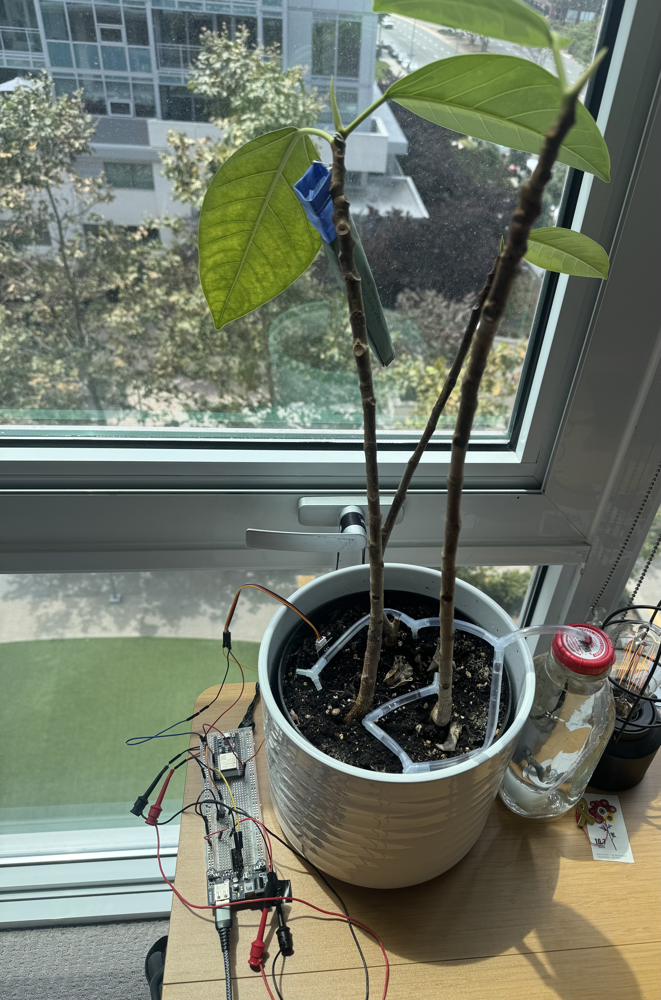
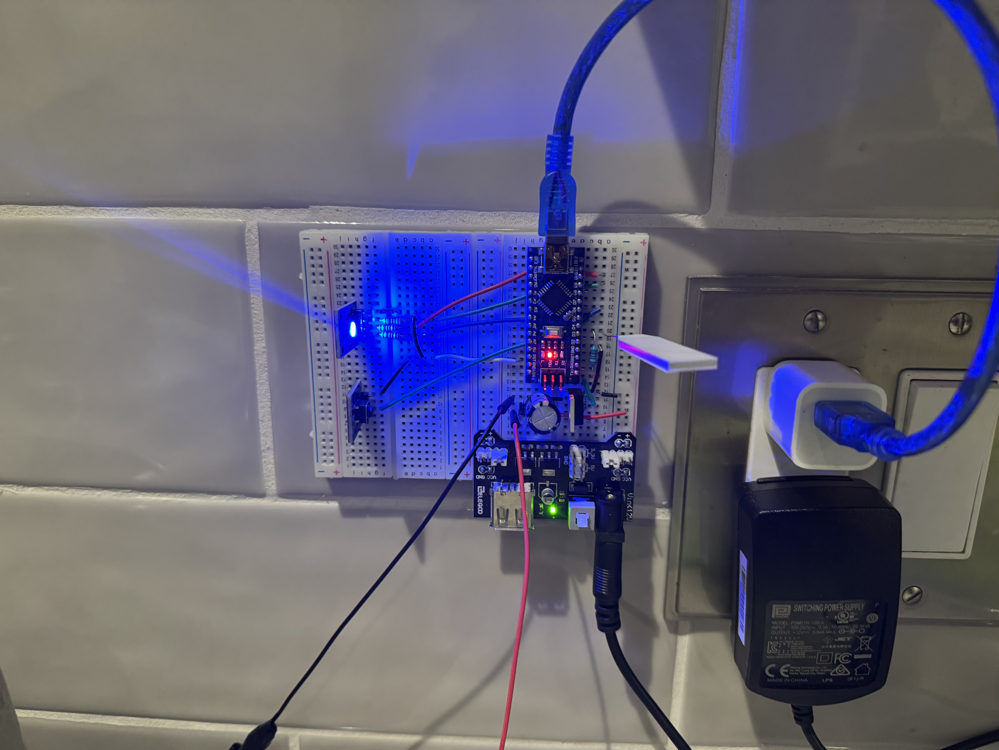
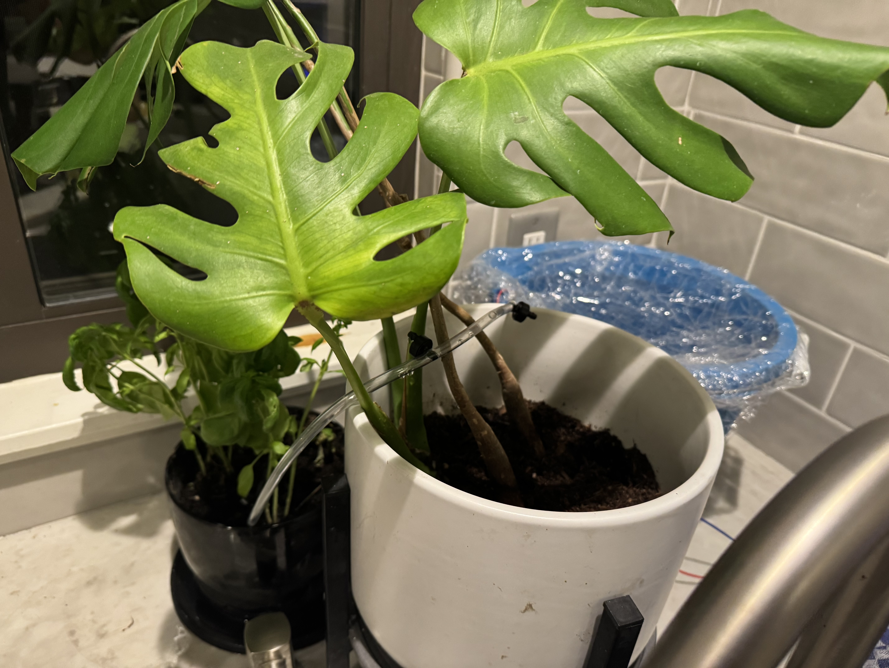
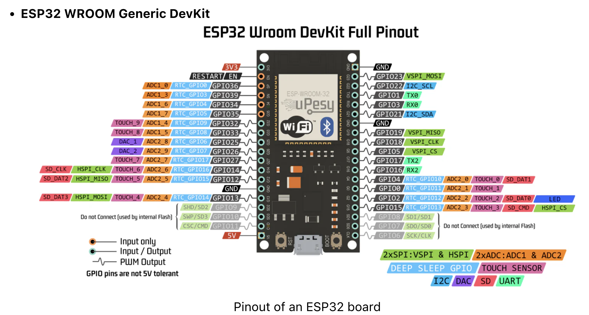
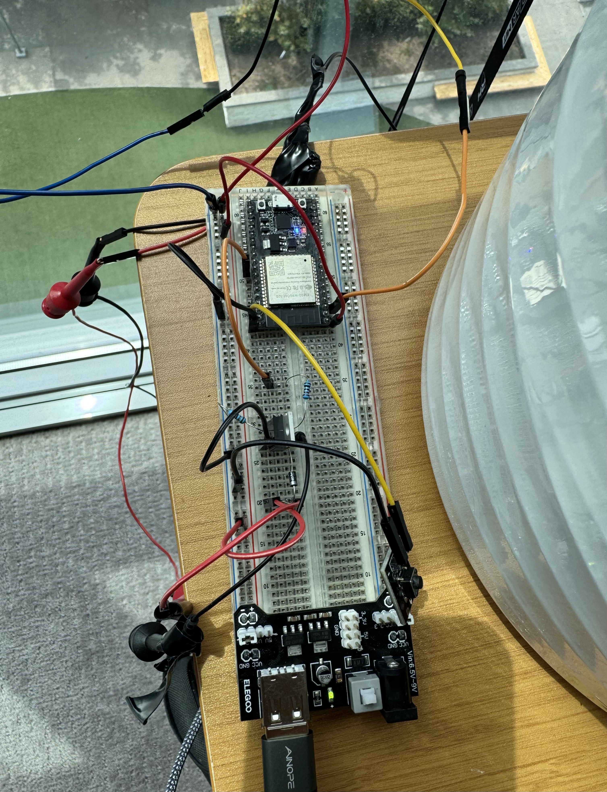

# 🤖 Sprinkletron

An affectionately faithful plant waterer 🤖 💖 🌱 🦾

It runs in two modes.

1. Interval mode - waters every N hours for M minutes
2. Soil moisture mode - waters when soil is dry, checks every N hours, waters if necessary.

You can find either program in the sketch folder. Drag it out into src and rename to main.cpp to use. Interval should run on any architecture, soil moisture mode is ESP32 only.

If using rainbird gph heads, provide the total gallons per hour in the system and the water tank capacity and it will calculate how many activations to run. This is so the pump doesn't dry out.

For example if we have a system of 4 x 1 gph heads. We want to water 5 min every activation. And we draw water from a 2 gallons bucket.

max activations = 6

$4 \text{gph} \times \frac{1}{12} \text{hours} = \frac{1}{3} \text{ gallons per activation}$

$2/\frac{1}{3} \text{ gallons per activation} = 6$

|  |      |
| :-----------------------: | :---------------------------: |
|   sad and forgotten 😢    | happy and taken care of 😎 🦾 |

## Interval mode

|             |  |
| :----------------------------------: | :-----------------------: |
| interval mode with two power sources |      GPH heads setup      |

## Install

I used [PlatformIO](https://platformio.org/) to build and upload the code to the ESP32. Get the VSCode extension or just install the CLI tool.

```bash
pio project init --board esp32dev
```

## Build and deploy

```bash
pio run -e esp32dev -t upload
```

## Hardware

[ESP32 microcontroller](https://www.amazon.com/HiLetgo-ESP-WROOM-32-Development-Microcontroller-Integrated/dp/B0718T232Z/ref=sr_1_3_pp?crid=2CQV94O1OGR6H&dib=eyJ2IjoiMSJ9.kzd_BN2te2KAhw5tyJI73iwZ9stA77zzn51rdKmEszU4feVIJwvlwVF7kBoWgQPeMgyoptu8p8PzFvEWpxs40OoVDV9nYCBotN80_zApyaZimXkio5ei2YzGSVvl4dqeCSIJUxzCsaTnyW31OWoWwsTuaZWMGaY5S9vqwavqU0O-cqKcmrz-FhhcZC4ucgOs61cPUe_J0Nli8lbT-HIqCe1nEO4xkyimmhq6HhRRjuQ.lS9xh2RYkxiqmAJ3G8zQThrpcej4UvebpuDbfTgma1s&dib_tag=se&keywords=esp32&qid=1755052045&sprefix=esp%2Caps%2C191&sr=8-3) - A low-power microcontroller with built-in Wi-Fi and Bluetooth capabilities. It is used to control the watering system.

[Breadboard power supply](https://www.amazon.com/Breadboard-Minidodoca-Alligator-Raspberry-Electronic/dp/B0BP9V6WXX/ref=sr_1_1?crid=U1BJFQH6YTKS&dib=eyJ2IjoiMSJ9.oSeKeuwdMzQHSh6XMZ9xst5nq7arbypQQPb5RQhmqlM97TPUxVJbHUCrqBxC0q58dG8GDxHlrEOWtG4X1uttjTsbqlgioDu1OsmwSiv1T-da3vqRt6rwmdx-IYf7ahkuhM0vv54AfiAK3Kq0QQeolcn7nNYEyq1vPacTNDdmzyMU7DxKe6UwdqhZNTGvS-2YYOMkUxrkH19ex5qmsdEDKaeLCkcuxfWEd9lq-dfpzUM.uC9mFgUy00We1Vr0BWzcHfaiN8h9xt-ibtmd8Q9CYbc&dib_tag=se&keywords=elegoo%2Bbread%2Bboard%2Bpower%2Bsupply&qid=1755052097&sprefix=elegoo%2Bbread%2Bboard%2Bpower%2Bsupply%2B%2Caps%2C167&sr=8-1&th=1) - A power supply module that can be plugged into a breadboard to provide power to the ESP32 and other components. It provides 3.3V and 5V outputs.

[Capacitive Soil Moisture Sensor](https://www.amazon.com/dp/B07SYBSHGX?ref=ppx_yo2ov_dt_b_fed_asin_title) - Corrosion Resistant Moisture Detection Garden Watering for Arduino DIY 3.3~5.5V

[Submersible 3V DC Pump](https://www.amazon.com/dp/B085KYZCDV?ref=ppx_yo2ov_dt_b_fed_asin_title) - A small 3V DC pump that can be used to water plants. a DC motor that is powered with 3V and draws 100mA. When powered, the pump sucks water in from the side of the plastic casing and pushes it out the tubing port. The pump must be primed by keeping it inside water at all times. You can PWM the motor power to speed up or slow down the flow rate.

[N-Channel Power MOSFET](https://www.amazon.com/dp/B08ZKYXN2M?ref=ppx_yo2ov_dt_b_fed_asin_title) - The MOSFET when it recieves 3.3v HIGH signal from the ESP32 will complete the pump circuit to ground allowing the pump to run. The MOSFET is used to switch the pump on and off.

[Schottky Diode](https://www.amazon.com/dp/B0C1V6Y8ND?ref=ppx_yo2ov_dt_b_fed_asin_title) - A diode that is used to protect the MOSFET from back EMF when the pump is turned off. The cathode of the diode is connected to the +3.3V supply and the anode is connected to the pump negative terminal.

RAINBIRD GPH HEADS:
If you want to use these heads, just realize you may need two power sources as they cause the pump to draw more current causing MCU brownout if both are connected to the same 3v3 rail. Instead connect your MCU to power using the usb power input and connect the pump to a separate 3.3V power supply. Also it can help to add a large capacitor across the pump terminals to smooth out current spikes.

## Wiring



I used a breadboard to wire the components together. The wiring is as follows:

- Soil moisture sensor:

  - VCC → 3V3
  - GND → GND
  - A0 → GPIO36 (ADC1)

  Sensor values vary, best to test in your own setup.

- Pump:

  - VCC → 3V3
  - GND → GND
  - IN → GPIO18 (MOSFET gate)

- MOSFET:

  - Source → GND
  - Drain → Pump GND
  - Gate → (GPIO18 → 220Ω → GATE → 100kΩ pulldown to GND to keep it off at boot)

- Diode:

  - Cathode → in front of pump +3.3V
  - Anode → in front of Pump negative terminal

- ESP32:

  - GND → GND
  - power supply → 5V
  - pin GPIO18 → Pump MOSFET gate



## Pulse with Modulation (PWM)

Digital devices output 1's and 0's. i.e HIGH or LOW signal. So how do we change the power of the motor if we can only tell it to be ON or OFF? It turns out that we can approximate an analog signal by switching the pump on for a period of time and off again in a repeating cycle. This technique is called Pulse Width Modulation (PWM). The ratio of the time the pump is on to the total time of the cycle is called the duty cycle. The duty cycle is expressed as a percentage, where 100% means the pump is always on, and 0% means it is always off.

Lets say we want the water pump to run at 80% of its maximum power.

Given that the pump runs at 20,000 cycles per second.

$$
f = 20000 \text{ Hz}
$$

Then the time it takes to complete a single cycle is expressed as the period $T$:

$$
T = f^{-1} = \frac{1}{20000} = 0.00005 \text{ seconds} = 50 \mu s
$$

For the $50\mu s$ in each cycle, we want the pump to be on for 80% of the time and off for 20%.

$$
T_{on} = D * T = 0.8 * 50 \mu s = 40 \mu s
$$

$$
T_{off} = (1 - D) * T = 0.2 * 50 \mu s = 10 \mu s
$$

The math is for illustration. The actual timing is handled at a lower level. All we need to do is set the appropriate values in the programming interface and it calculates and fires the PWM pulses itself. For the esp32 microcontroller we need to configure the PWM channel range. What does this mean? We are setting the denominator in the duty cycle ratio. In our case we set it to 10 bits, which gives us a range of values from 0 to 1023.

$$
\text{channel 0 bit space} = 2^{10} - 1 = 1023
$$

$$
\text{duty cycle} = D * T = 0.8 * 1023\approx 818
$$

```cpp
//setup PWM channel
ledcSetup(0, 20000, 10);

// notice that D in the programming case is an integer value 80, not a floating point 0.8
// We do this in integer math the entire time. For embedded systems this is important
// Avoiding the floating point overhead keeps the code fast and efficient
int maxDuty = (1 << PWM_RES_BITS) - 1; // 1023 for 10 bits
int duty = (80 * maxDuty) / 100; // 80% duty cycle
ledcWrite(PWM_CH, duty);
```

Now for each $50 \mu s$ cycle we get the pump on for $40 \mu s$ and off for $10 \mu s$. This approximates 80% power with a digital signal.

## Notes

- Make sure all ground is common between the ESP32, pump, all sensors.
- State machines are the most underrated concept in all of programming.
- PWM - understand the duty cycle.
- don't forget semicolons when compiling C++ code.

### Risks & Mitigations

- **Noisy sensor / false dry:** median filter + enforce min hours between waterings
- **Flooding if stuck-low sensor:** hard cap on pump run time; min interval block
- **Boot-time glitches:** pump gate pulldown resistor; initialize gate LOW early
- **Power draw:** deep sleep between checks; sensor only powered while measuring
